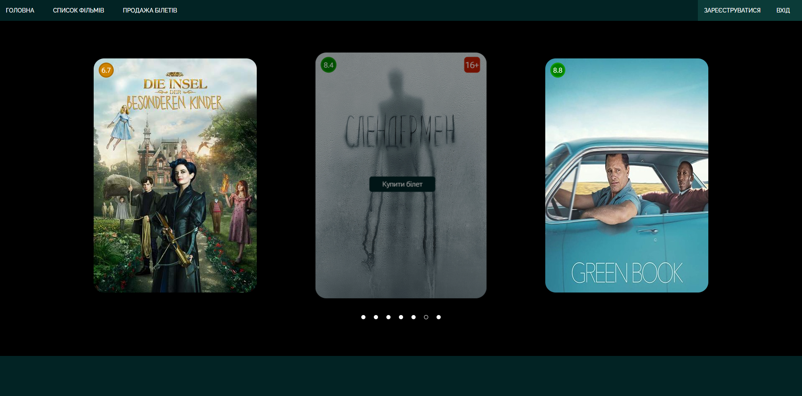

#  Вебсайт Кінотеатру / Movie Theatre Website
**Використані Технології:**  HTML, CSS, JavaScript, PHP, PHPMYADMIN, XAMPP
**Technologies Used:**  HTML, CSS, JavaScript, PHP, PHPMYADMIN, XAMPP

Цей проєкт являє собою вебсайт кінотеатру, що дозволяє користувачам переглядати доступні фільми та купувати квитки. Вебсайт взаємодіє з базою даних PHPMYADMIN для керування списками фільмів та продажем квитків. Ключові функції проєкту включають слайдер фільмів на головній сторінці, просту форму опису фільму, інтерфейс вибору квитків та форму покупки квитка, яка зберігає дані картки (функціонал реальної оплати не реалізований).

This project is a comprehensive movie theatre website that allows users to browse available films and purchase tickets. The website interacts with a PHPMYADMIN database to manage movie listings and ticket sales. Key features of the project include a homepage slider showcasing films, a simple movie description form, a ticket selection interface, and a ticket purchase form that captures card details (note: real payment functionality is not implemented).

Динамічний слайдер на головній сторінці показує поточні фільми, забезпечуючи захоплюючий користувацький досвід.

A dynamic slider on the homepage displays current films, providing an engaging user experience.

Проста форма збирає дані користувача та інформацію про картку для покупки квитків. Проте реальний процес оплати не функціонує.

 A simple form captures user details and card information for ticket purchases. However, the actual payment processing is not functional.

Вебсайт інтегрується з базою даних PHPMYADMIN через PHP-скрипти для ефективного керування інформацією про фільми та квитки.

The website integrates with a PHPMYADMIN database through PHP scripts to manage film listings and ticket information efficiently.